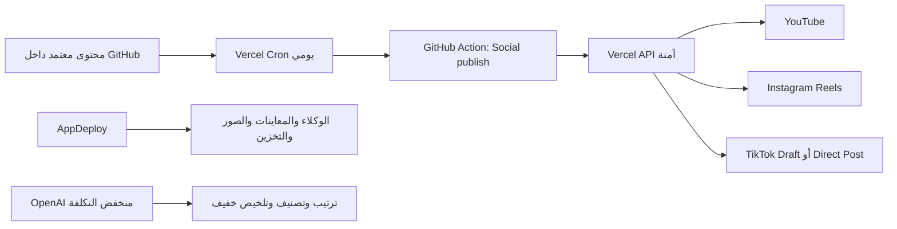

# إعداد النشر التلقائي — مرصد تسعة Pro

هذا الدليل يجهّز النظام الهجين بالشكل التالي:



## قواعد الأمان قبل البداية

- لا ترفع أي قيمة سرية إلى GitHub أو داخل ملفات المشروع.
- ضع مفاتيح المنصات داخل **Vercel Environment Variables** فقط.
- ضع مفاتيح الربط بين GitHub وVercel داخل **GitHub Actions Secrets**.
- ابدأ دائمًا بـ `SOCIAL_PUBLISH_MODE=dry-run`.
- لا تغيّر إلى `live` إلا بعد اختبار محتوى خاص أو غير مدرج.
- TikTok Direct Post يتطلب موافقة المستخدم الصريحة وتدقيق التطبيق للنشر العام. التطبيقات غير المدققة تنشر بوضع خاص فقط، واستخدام أداة داخلية لرفع محتوى حساب واحد قد لا يُقبل في مراجعة TikTok.

---

# 1. متغيرات Vercel المطلوبة

من Vercel:

1. افتح المشروع.
2. اختر **Settings**.
3. اختر **Environment Variables**.
4. أضف القيم لكل من Production وPreview عند الحاجة.
5. لا تعرض القيم في لقطات الشاشة أو المحادثات.

| المتغير | الغرض | مطلوب الآن؟ |
|---|---|---|
| `SOCIAL_PUBLISH_MODE` | `dry-run` أو `live` | نعم — ابدأ بـ `dry-run` |
| `ADMIN_API_TOKEN` | يحمي `/api/social/*` | نعم |
| `CRON_SECRET` | يحمي مسار Vercel Cron | نعم |
| `OPENAI_API_KEY` | مهام النص الخفيفة فقط | موجود عندك |
| `OPENAI_MODEL` | النموذج الاقتصادي | ضع `gpt-5-nano` |
| `YOUTUBE_CLIENT_ID` | OAuth ليوتيوب | عند ربط YouTube |
| `YOUTUBE_CLIENT_SECRET` | OAuth ليوتيوب | عند ربط YouTube |
| `YOUTUBE_REFRESH_TOKEN` | رفع مستمر دون تسجيل كل مرة | عند ربط YouTube |
| `TIKTOK_CLIENT_KEY` | تعريف تطبيق TikTok | عند ربط TikTok |
| `TIKTOK_CLIENT_SECRET` | سر تطبيق TikTok | عند ربط TikTok |
| `TIKTOK_ACCESS_TOKEN` | استدعاء Content Posting API | عند ربط TikTok |
| `TIKTOK_REFRESH_TOKEN` | تجديد رمز TikTok | عند ربط TikTok |
| `TIKTOK_OPEN_ID` | معرف الحساب المفوض | اختياري حاليًا |
| `TIKTOK_POST_MODE` | `draft` أو `direct` | ضع `draft` مبدئيًا |
| `INSTAGRAM_ACCESS_TOKEN` | نشر Reels | عند ربط Instagram |
| `INSTAGRAM_IG_USER_ID` | معرف الحساب الاحترافي | عند ربط Instagram |
| `INSTAGRAM_GRAPH_API_VERSION` | إصدار Graph API من لوحة Meta | نعم عند الربط |
| `GITHUB_DISPATCH_TOKEN` | يسمح لـVercel بتشغيل Workflow | عند تفعيل Cron |
| `GITHUB_REPOSITORY` | مثال `moha700m/marsad-tisaa-pro` | عند تفعيل Cron |
| `GITHUB_WORKFLOW_FILE` | اسم Workflow | `social-publish.yml` |
| `GITHUB_DEFAULT_BRANCH` | الفرع | `main` |

### إنشاء رموز الحماية

شغّل محليًا مرتين للحصول على قيمتين مختلفتين:

```bash
node -e "console.log(require('crypto').randomBytes(32).toString('hex'))"
```

استخدم الأولى لـ`ADMIN_API_TOKEN` والثانية لـ`CRON_SECRET`.

---

# 2. أسرار GitHub Actions

من GitHub:

1. افتح المستودع.
2. اختر **Settings**.
3. اختر **Secrets and variables** ثم **Actions**.
4. داخل **Secrets** أضف:

| Secret | القيمة |
|---|---|
| `SOCIAL_PUBLISH_ENDPOINT` | `https://YOUR-PROJECT.vercel.app/api/social/publish` |
| `SOCIAL_PUBLISH_ADMIN_TOKEN` | نفس قيمة `ADMIN_API_TOKEN` الموجودة في Vercel |
| `APPDEPLOY_BACKUP_ENDPOINT` | `https://441a4987f6936b832e.v2.appdeploy.ai/api/admin/backup` |
| `APPDEPLOY_BACKUP_TOKEN` | نفس سر `BACKUP_TOKEN` الذي ستضعه في AppDeploy |

5. داخل **Variables** أضف:

| Variable | القيمة |
|---|---|
| `PRODUCTION_URL` | رابط Vercel الإنتاجي الكامل |

---

# 3. YouTube Data API خطوة بخطوة

مرجع Google الرسمي:

- https://developers.google.com/youtube/v3/getting-started
- https://developers.google.com/youtube/v3/guides/authentication
- https://developers.google.com/youtube/v3/guides/uploading_a_video

## إنشاء المشروع والمفاتيح

1. افتح Google Cloud Console.
2. أنشئ Project باسم قريب من `Marsad Tisaa Publisher`.
3. افتح **APIs & Services → Library**.
4. ابحث عن **YouTube Data API v3** واضغط **Enable**.
5. افتح **OAuth consent screen**.
6. اختر نوع المستخدم المناسب لحسابك، وأضف اسم التطبيق والبريد.
7. أضف Scope التالي فقط:

```text
https://www.googleapis.com/auth/youtube.upload
```

8. افتح **Credentials → Create Credentials → OAuth client ID**.
9. استخدم Web Application أو Desktop للتجربة المحلية.
10. أضف Redirect URI مطابقًا للقيمة التي ستستخدمها، مثال:

```text
http://localhost:53682/oauth2callback
```

11. انسخ Client ID وClient Secret إلى ملف `.env.local` محلي فقط، وليس GitHub.

## استخراج Refresh Token بالأداة المرفقة

ضع محليًا:

```bash
export YOUTUBE_CLIENT_ID="..."
export YOUTUBE_CLIENT_SECRET="..."
export YOUTUBE_REDIRECT_URI="http://localhost:53682/oauth2callback"
```

اطبع رابط التفويض:

```bash
npm run oauth:youtube -- url
```

1. افتح الرابط.
2. اختر قناة YouTube الصحيحة.
3. وافق على صلاحية الرفع.
4. سيعود المتصفح إلى localhost وقد تظهر صفحة غير متاحة؛ انسخ قيمة `code` من شريط العنوان.
5. بدّل الكود برمز دائم:

```bash
npm run oauth:youtube -- exchange --code="PASTE_CODE"
```

6. ضع `refresh_token` الناتج في Vercel باسم `YOUTUBE_REFRESH_TOKEN`.
7. اختبر أول فيديو مع `privacyStatus=private`.

> YouTube لا يدعم Service Account للقنوات العادية؛ يجب OAuth 2.0 لحساب القناة.

---

# 4. TikTok Content Posting API خطوة بخطوة

مراجع TikTok الرسمية:

- https://developers.tiktok.com/products/content-posting-api
- https://developers.tiktok.com/doc/content-posting-api-get-started-upload-content
- https://developers.tiktok.com/doc/content-posting-api-reference-direct-post
- https://developers.tiktok.com/doc/oauth-user-access-token-management
- https://developers.tiktok.com/doc/content-sharing-guidelines

## إنشاء التطبيق

1. افتح TikTok for Developers وسجّل دخولك.
2. من **Manage apps** أنشئ تطبيق Web.
3. أضف **Login Kit**.
4. أضف **Content Posting API**.
5. أضف رابط الموقع وسياسة الخصوصية والشروط.
6. تحقق من ملكية الدومين أو URL Prefix، خصوصًا إذا ستستخدم `PULL_FROM_URL`.
7. أضف Redirect URI ثابتًا وHTTPS، مثال:

```text
https://YOUR-PROJECT.vercel.app/api/oauth/callback
```

8. اطلب Scopes المطلوبة:

```text
user.info.basic
video.upload
video.publish
```

9. `video.upload` يرسل الفيديو كمسودة داخل TikTok ليكمل المستخدم النشر.
10. `video.publish` للنشر المباشر ويحتاج موافقة وتدقيق التطبيق.

## الحصول على Access Token وRefresh Token

ضع محليًا:

```bash
export TIKTOK_CLIENT_KEY="..."
export TIKTOK_CLIENT_SECRET="..."
export TIKTOK_REDIRECT_URI="https://YOUR-PROJECT.vercel.app/api/oauth/callback"
export TIKTOK_SCOPES="user.info.basic,video.upload,video.publish"
```

اطبع رابط التفويض وحالة `state`:

```bash
npm run oauth:tiktok -- url
```

بعد رجوع TikTok إلى Redirect URI، تفتح صفحة آمنة تعرض `code` و`state` داخل المتصفح. طابق `state` مع القيمة التي طبعها السكربت، ثم اضغط **انسخ أمر الاستبدال** أو نفّذ:

```bash
npm run oauth:tiktok -- exchange --code="PASTE_CODE"
```

ضع القيم الناتجة في Vercel:

- `TIKTOK_ACCESS_TOKEN`
- `TIKTOK_REFRESH_TOKEN`
- `TIKTOK_OPEN_ID`

لتجديد الرمز:

```bash
npm run oauth:tiktok -- refresh
```

### وضع التشغيل الموصى به أولًا

```text
TIKTOK_POST_MODE=draft
SOCIAL_PUBLISH_MODE=dry-run
```

بعد اعتماد التطبيق واختبار تجربة موافقة المستخدم:

```text
TIKTOK_POST_MODE=direct
SOCIAL_PUBLISH_MODE=live
```

وكل Manifest للنشر المباشر يجب أن يحتوي:

```json
{
  "approvedAt": "2026-07-24T15:00:00.000Z",
  "platformSettings": {
    "tiktok": {
      "mode": "direct",
      "userApproved": true,
      "privacyLevel": "SELF_ONLY"
    }
  }
}
```

---

# 5. Instagram Reels خطوة بخطوة

مراجع Meta الرسمية المنشورة في مجموعة Meta الرسمية على Postman:

- https://www.postman.com/meta/workspace/instagram/overview
- https://www.postman.com/meta/workspace/instagram/documentation/23987686-9386f468-7714-490f-9bfc-9442db5c8f00

## المتطلبات

- الحساب يجب أن يكون Instagram Professional: Business أو Creator.
- عند استخدام Facebook Login، يجب ربطه بصفحة Facebook.
- الصلاحيات المعتادة:

```text
pages_show_list
instagram_basic
instagram_content_publish
pages_read_engagement
```

أو عند استخدام Instagram Login الحديث:

```text
instagram_business_basic
instagram_business_content_publish
```

## الإعداد

1. افتح Meta for Developers.
2. أنشئ Business App.
3. أضف Instagram API.
4. اربط حساب Instagram الاحترافي.
5. أنشئ User Access Token بالصلاحيات المطلوبة.
6. استخرج Page Access Token طويل المدة عند استخدام Facebook Login.
7. استخرج `IG User ID` من Graph API Explorer أو مجموعة Postman الرسمية.
8. ضع في Vercel:

```text
INSTAGRAM_ACCESS_TOKEN=...
INSTAGRAM_IG_USER_ID=...
INSTAGRAM_GRAPH_API_VERSION=vXX.X
```

استخدم إصدار Graph API الظاهر في لوحة تطبيقك ولا تعتمد رقمًا قديمًا من الإنترنت.

## طريقة النشر داخل النظام

1. إنشاء Reel Container عبر `/media` مع `media_type=REELS` و`video_url`.
2. متابعة حالة الحاوية حتى `FINISHED`.
3. نشرها عبر `/media_publish`.

الفيديو يجب أن يكون على رابط HTTPS عام تستطيع Meta قراءته.

---

# 6. إعداد Vercel Cron

Vercel يقرأ الإعداد من `vercel.json`. المشروع مضبوط حاليًا لتشغيل:

```text
/api/cron/publish-pending
```

مرة يوميًا الساعة 16:00 UTC، أي 19:00 بتوقيت السعودية.

- Vercel Cron يعمل بتوقيت UTC.
- خطة Hobby تسمح بتشغيل يومي فقط ودقتها قد تكون ضمن الساعة.
- ضع `CRON_SECRET` ليُرسل كـBearer Token ويحمي المسار.

بعد النشر:

1. افتح Vercel Project.
2. **Settings → Cron Jobs**.
3. تحقق أن المهمة ظاهرة ومفعّلة.
4. افتح Runtime Logs وتأكد من استجابة `202`.

---

# 7. إعداد GitHub Dispatch Token

حتى يستطيع Vercel Cron تشغيل Workflow:

1. افتح GitHub **Settings → Developer settings → Personal access tokens → Fine-grained tokens**.
2. اختر المستودع فقط.
3. امنح أقل صلاحية لازمة:
   - Actions: Read and write.
   - Metadata: Read.
4. انسخ الرمز مرة واحدة إلى Vercel باسم `GITHUB_DISPATCH_TOKEN`.
5. ضع اسم المستودع في `GITHUB_REPOSITORY` بصيغة `owner/repo`.

لا تضع PAT في GitHub نفسه ولا داخل الكود.

---

# 8. AppDeploy Backup

AppDeploy يبقى مصدر الوكلاء والمشاريع والمعاينات. تمت إضافة endpoint:

```text
GET /api/admin/backup
Header: x-backup-token: YOUR_TOKEN
```

لتفعيله:

1. أنشئ قيمة عشوائية 32 بايت.
2. أضفها إلى AppDeploy Secret باسم `BACKUP_TOKEN`.
3. أضف نفس القيمة إلى GitHub Secret باسم `APPDEPLOY_BACKUP_TOKEN`.
4. أضف رابط endpoint إلى `APPDEPLOY_BACKUP_ENDPOINT`.
5. شغّل Workflow **Daily AppDeploy backup** يدويًا أول مرة.
6. تأكد من ظهور Artifact، ولا ترفع النسخة الاحتياطية إلى المستودع.

---

# 9. تجهيز المحتوى واعتماده

المجلد:

```text
/content/pending-uploads/
```

كل ملف JSON يحتوي الفيديو والعنوان والوصف والمنصات والوقت.

## الفحص بدون نشر

```bash
npm run content:validate
npm run social:publish -- --dry-run
```

## اعتماد محتوى

غيّر:

```json
{
  "status": "pending",
  "approvedAt": "2026-07-24T15:00:00.000Z"
}
```

بعدها Vercel Cron يشغّل GitHub Action، وGitHub Action يستدعي Vercel، ثم يحفظ نتيجة كل منصة في ملف المحتوى لمنع التكرار.

---

# 10. ترتيب التفعيل الآمن

1. ارفع هذا الإصدار إلى فرع جديد.
2. انتظر Preview Deployment.
3. شغّل CI وراجع `/api/health`.
4. فعّل Analytics وSpeed Insights من Vercel Dashboard.
5. أضف `ADMIN_API_TOKEN` و`CRON_SECRET`.
6. اختبر `/api/social/publish` بوضع Dry Run.
7. اربط YouTube واختبر فيديو Private.
8. اربط Instagram واختبر Reel تجريبي غير معلن عند توفر خيار مناسب.
9. اربط TikTok بوضع Draft.
10. لا تحول `SOCIAL_PUBLISH_MODE` إلى `live` إلا بعد نجاح كل منصة منفردة.

---

# 11. أفضل وقت للنشر

لا توجد بيانات حسابات كافية الآن لإعطاء وقت “أفضل” حقيقي. الوقت الافتراضي الحالي **19:00 بتوقيت السعودية** هو نقطة اختبار فقط. بعد جمع بيانات فعلية من المنصات وVercel Analytics لمدة أسبوعين، تُقارن:

- وصول كل منشور حسب الساعة واليوم.
- معدل إكمال مشاهدة الفيديو.
- النقرات على رابط الموقع.
- التحويل إلى «ابدأ مشروعك الحين».

بعدها يُعدل الجدول بناءً على بيانات حساباتك بدل نصائح عامة.
